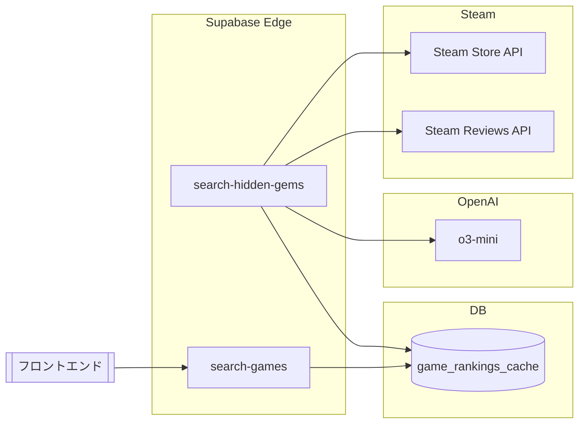

# Steam Hidden Gems Finder
API取得設計メモ（コスト最適化版）

---

## 1. 目的

- **目的:** Steam で「登録料すら回収できていない」タイトルを、できるだけ早い段階で発見・支援する。
- そのために、Steam API ＋ OpenAI（gpt-4.1-mini）を使って、
  - レビュー内容から「隠れた良作」かどうかを解析
  - Supabase にキャッシュしつつ、検索エンジン的に利用できるようにする。
- ただし、**Steam API と OpenAI API の消費をできるだけ抑える**ことを前提に設計する。

---

## 2. 全体アーキテクチャ（API視点）

### 2.1 エッジ関数の役割分担

1. **`search-hidden-gems`（インポート＆解析）**
   - 入力: `appId`（単体 or 複数）
   - 外部 API 呼び出し:
     - Steam Store API: `/api/appdetails?appids={appId}`
     - Steam Reviews API: `/appreviews/{appId}?json=1&…`
     - OpenAI Chat Completions: `model=o3-mini`
   - 処理内容:
     - Steam からタイトル情報・価格・ジャンル・レビュー統計・レビュー本文（最大20件）を取得
     - レビュー本文を OpenAI に渡して、`GameAnalysis`（summary / pros / cons / reviewQualityScore / riskScore / bugRisk / refundMentions / hiddenGemVerdict）を取得
     - `positiveRatio` や `isStatisticallyHidden` と組み合わせて `gemLabel` を決定
     - 結果を Supabase の `game_rankings_cache.data` に丸ごと保存

2. **`search-games`（検索＆一覧）**
   - 入力: ソート・フィルタ条件（sort, genre, minReviews, recentDays, Custom Gem Score 重み etc.）
   - 外部 API 呼び出し:
     - なし（Supabase DB からの読み取りのみ）
   - 処理内容:
     - `game_rankings_cache` から最大 N 件を取得
     - 条件でフィルタリング（ジャンル・レビュー数・価格・期間etc.）
     - `Gem Score` / `Custom Gem Score` でソート
     - フロントが表示する RankingGame の配列を返す

👉 **重要:** 「検索」「並び替え」に AI API を一切使わず、**解析済みキャッシュだけで対応**するのがコスト削減の肝。

---

## 3. データフロー（キャッシュ前提）

- **AI コストが発生するのは `C: search-hidden-gems` のみ。**
- `D: search-games` は DB から読むだけなので、検索回数がいくら多くても OpenAI コストは増えない。

---

## 4. API消費を抑えるための基本方針

### 4.1 「何回検索されたか」ではなく「何本解析したか」でコストを見る

- OpenAI API のコスト = **解析対象ゲーム本数 × 1ゲームあたりコスト**
- 1ゲーム = レビュー20件＋プロンプトで数千トークン → o3-mini で **約0.2〜0.3円/本（多めの見積もり）**
- 検索回数は、`search-games` が DB だけを見る設計にしておけばコストに影響しない。

👉 設計のポイントは「**どのゲームを、いつ解析するか**」の戦略設計。

---

## 5. Steam API / OpenAI APIそれぞれの節約ロジック

### 5.1 Steam API 側

1. **対象ゲームをそもそも絞る**
   - 例）
     - レビュー数 20〜2000
     - 価格 3〜40ドル
     - 発売から 90 日以内（recentDays = 90 をコアに）
   - 目的: 「登録料すら回収できていない」ゾーンに近い作品だけを見る
   - 超有名作・超格安スパム作品を除外して、無駄な API ＆ AI コールを削減。

2. **1タイトルあたりの取得回数を最小限に**
   - `game_rankings_cache` にキャッシュしたら、同じ `appId` に対しては
     - 短期的には再度 Steam API を叩かない
     - `lastUpdated` から一定期間経つまでは再取得しない（例: 90日〜180日）

3. **バッチ取得の工夫**
   - 可能であれば Steam Store API は複数 appId をまとめて投げる
   - Reviews API は `num_per_page` を適切に絞る（過剰にレビューを取らない）

---

### 5.2 OpenAI API 側（o3-mini）

1. **解析は「初回だけ」＋キャッシュ前提**
   - `appId` ごとに解析結果（analysis + gemLabel）を `game_rankings_cache.data` に保存
   - 同じゲームが検索結果に何度出ても、**解析結果は読み出すだけで再計算しない**

2. **新規タイトルにフォーカスする設計**
   - releaseDate を基準に「直近90日」をコア対象にする
   - バッチ処理で、毎日 or 毎週「新しく90日ウィンドウに入ったゲーム」だけ解析
   - 全 Steam を一気に解析せず、**ウィンドウ内だけを常に最新に保つ感覚**。

3. **解析対象の優先順位づけ**
   - 例）
     - まずはレビュー数 20〜2000 の新作だけ
     - 次にユーザーからのクリック数が多いのに解析されていないゲーム
   - 優先度の低いゲームは「必要になったときに初めて解析」するオンデマンド方式もアリ。

4. **再解析の頻度を制御する**
   - `lastUpdated` を見て、例えば：
     - 半年 or 1年を過ぎたタイトルだけ夜間に少しずつ再解析
     - 基本は「1本あたり1回解析」で十分
   - 大型アップデートで評価が激変するケースだけ、手動 or バッチで再解析キューに入れる。

---

## 6. 運用パターン例

### 6.1 V1：直近90日の新作フォーカス

- バックエンド
  - バッチ or ジョブで `releaseDate` が直近90日のタイトルをクロール
  - 絞り込み条件（レビュー数・価格レンジ）を満たすゲームだけ `search-hidden-gems` を実行
  - 解析結果を `game_rankings_cache` に保存

- フロント（Rankings）
  - デフォルト期間: 「Last 90 days」
  - ソート: Gem Score / Custom Gem Score
  - 検索は常に `search-games` を叩くだけ → OpenAI コスト 0

### 6.2 拡張：All time / 過去1年も見たい場合

- フロントで期間フィルタを切り替え（30 / 60 / 90 / 365 / All）
- `search-games` の `recentDays` を切り替えるだけで実現
- 解析されていない古いゲームが混ざってきたら：
  - 初回は統計情報だけで並べる
  - クリックされたゲームをログに残し、バックグラウンドで `search-hidden-gems` にキューイングして解析

👉 こうすることで、**「ユーザーが興味を持ったゲームから順番に賢くなる検索エンジン」**として進化させられる。

---

## 7. コスト感のざっくり試算（o3-mini）

- 1ゲームの解析コスト ≒ **0.2〜0.3円**（多めの見積もり）
- 解析本数とコストのイメージ：

| 解析ゲーム本数 | 概算コスト（1回きり） |
|-----------------|------------------------|
| 1,000 本        | 200〜300 円            |
| 5,000 本        | 1,000〜1,500 円        |
| 10,000 本       | 2,000〜3,000 円        |
| 50,000 本       | 1〜1.5 万円            |

- 一度解析したゲームは DB にキャッシュされるため、
  - 検索されればされるほど、**1本あたりの「価値 / コスト比」は上がっていく**。

---

## 8. まとめ

- コストを抑える鍵は：
  1. **検索時に AI を叩かない（search-games は DB 専用）**
  2. **AI 解析は appId ごとに原則1回 ＋ キャッシュ前提**
  3. **対象ゲームを「直近90日 × レビュー数/価格レンジ」で絞る**
  4. **再解析は稀に・オンデマンドに・優先順位をつけて行う**

- これにより、
  - 「登録料すら回収できていない」作品群にフォーカスしつつ、
  - 数千〜数万タイトル規模でも現実的なコストで運用できる。

今後このメモをベースに、
- クローラー / バッチ処理の設計
- 解析キューの優先度制御
- ユーザーの行動ログを解析優先度に反映
などを肉付けしていけば、「埋もれた良作のための AI 検索エンジン」の全体像が固まっていきます。

